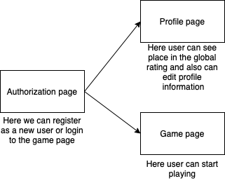

# CSS 410 Research tools and methods
## Team members
+ **Abu Said Manap** (*180103223*)- Backend Developer (GitHub account: *Abunyawa*)
+ **Adilkhan Nurgaliyev** (*180103282*) - Frontend Developer (GitHub account: *khan177*)
+ **Aizat Bissen** (*180103301*) -  UX/UI designer (GitHub account: *aizatbissen*)

## Project
Multiplayer maze game "Mr. Maze"\\n

## Alternatives / Market research
There are no any popular analogues\\n

## Goals
Create a game where players can compete with each other\\n

## Technologies
Languages: JS, Golang\\n
Framework: React.js, Gin\\n
Design: Figma\\n
Management: Jira, Confluence, Scrum\\n

## Pages / Activities 
Authorization page\\n
Admin page\\n
Profile page\\n
Game page\\n

## User Personas 
Everybody with free time and love to solve puzzles\\n

## User stories
As a player I want to be able to play with friends\\n
As a player I want to play new levels with different difficulty levels\\n
As a player I want to see the global rating\\n

## Sitemap, Page descriptions 

## Non-Functional requirements 
Scalability\\n
Capacity\\n
Availability\\n
Reliability\\n
Recoverability\\n
Maintainability\\n
Serviceability\\n

## Risks 
Users might get bored\\n
Cheap hostings might not be able to handle high load\\n
It might be hard to maintain project\\n

## Mockups, Wireframes 
In progress...\\n

## Future iterations 
Maintenance and adding features according to user desires\\n
